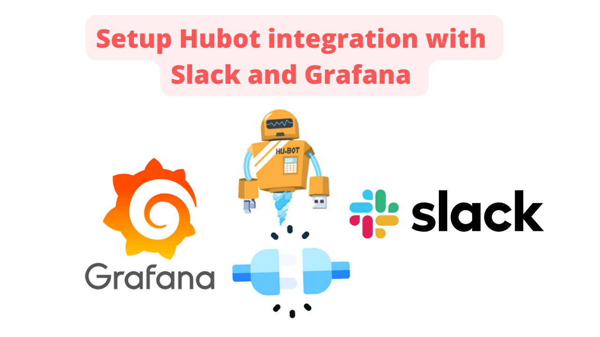
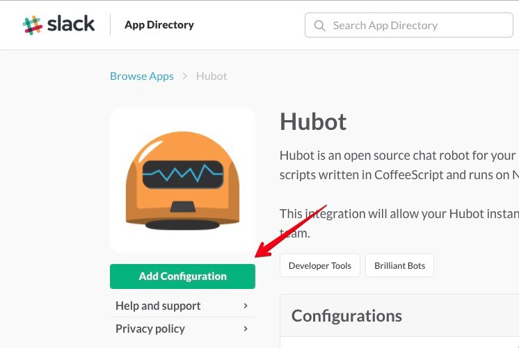
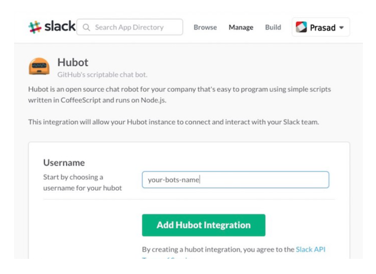
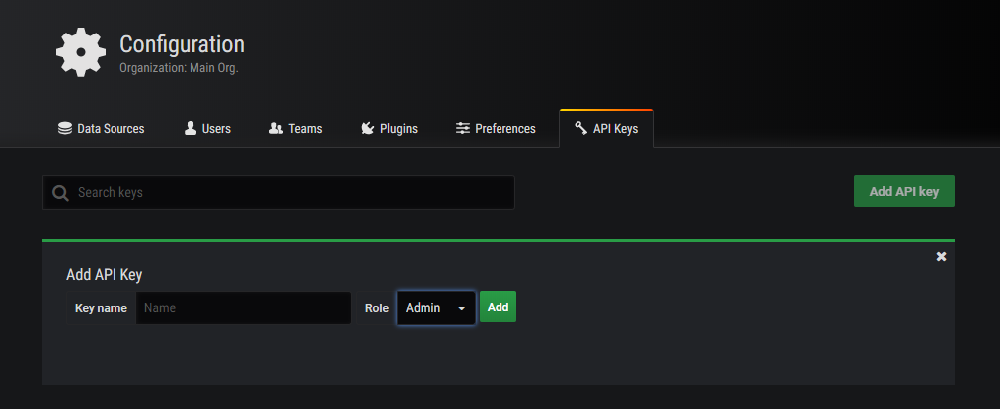

## How to Setup Hubot integration with Slack and Grafana


### Find the full youtube tutorial here 
[How to Setup Hubot integration with Slack and Grafana]()

#### 💬 If you have Questions or wannt have a chat - Join Me on Discord at:
[Apache NiFi Topics Q&A](https://discord.gg/qymAvnZqmQ)

[Data Engineering Topics Q&A](https://discord.gg/YykpUT5Wt2)

[Data Engineering  Compass Q&A](https://discord.gg/XR3JqUrA74)


[Official Hubot Documentation](https://hubot.github.com/docs/)

### Install node.js and npm and Hubot

##### If on Linux 
```
yum install -y https://dl.fedoraproject.org/pub/epel/epel-release-latest-7.noarch.rpm
yum install -y epel-releaseyum repolist
yum install nodejs npm
```

##### On Mac run the pkg installer from [Node JS website](https://nodejs.org/en/download/)

#### Install hubot generator
```
 npm install -g yo generator-hubot
```

#### Setup Bot project folder
```
mkdir <your location>
cd <your location>
```

#### Generate your Bot
 Here you will need to provide it with some inputs such as 
- Owner **InsightByte**
- Bot name **somebot**
- Description **some dumb bot**
- Bot adapter **slack**
```
yo hubot
 Please either fix that or report it to the module author
                     _____________________________
                    /                             \
   //\              |      Extracting input for    |
  ////\    _____    |   self-replication process   |
 //////\  /_____\   \                             /
 ======= |[^_/\_]|   /----------------------------
  |   | _|___@@__|__
  +===+/  ///     \_\
   | |_\ /// HUBOT/\\
   |___/\//      /  \\
         \      /   +---+
          \____/    |   |
           | //|    +===+
            \//      |xx|

? Owner InsightByte
? Bot name somebot
? Description some dumb bot
? Bot adapter slack
   create bin/hubot
   create bin/hubot.cmd
   create Procfile
   create README.md
   create external-scripts.json
   create hubot-scripts.json
   create .gitignore
   create package.json
   create scripts/example.coffee
   create .editorconfig
                     _____________________________
 _____              /                             \
 \    \             |   Self-replication process   |
 |    |    _____    |          complete...         |
 |__\\|   /_____\   \     Good luck with that.    /
   |//+  |[^_/\_]|   /----------------------------
  |   | _|___@@__|__
  +===+/  ///     \_\
   | |_\ /// HUBOT/\\
   |___/\//      /  \\
         \      /   +---+
          \____/    |   |
           | //|    +===+
            \//      |xx|

npm WARN EBADENGINE Unsupported engine {
npm WARN EBADENGINE   package: 'somebot@0.0.0',
npm WARN EBADENGINE   required: { node: '0.10.x' },
npm WARN EBADENGINE   current: { node: 'v16.16.0', npm: '8.11.0' }
npm WARN EBADENGINE }

```

#### Install hubot-grafana & hubot-alias plugin
See docs page [hubot-grafana](https://grafana.com/tutorials/integrate-hubot/)
```
 npm install hubot-grafana --save
 npm install hubot-alias --save
```

#### Edit the external-scripts.json and add the two new plugins hubot-grafana & hubot-alias
```
[
  "hubot-grafana",
  "hubot-alias",
  "hubot-diagnostics",
  "hubot-help",
  "hubot-heroku-keepalive",
  "hubot-google-images",
  "hubot-google-translate",
  "hubot-pugme",
  "hubot-maps",
  "hubot-redis-brain",
  "hubot-rules",
  "hubot-shipit"
]
```


### Create Slack App

Go to [https://slack.com/apps](https://slack.com/apps) search and add the Hubot to your workspace




Click on **Add Configuration** it will open another window to add some required details to finalize the installation.



## *Save the Slack api-key*


### Generate Grafana API-KEY

Go to yor Grafana Configuration -> api keys and click on **Add API Key** Then enter andm and select Role as Admin and click on **Add** to have the Grafana API Key





#### Export the Slack Token and Grafana Api Key & Grafana Host Address and set Log Level to Debug
```
export HUBOT_SLACK_TOKEN="Slack Token"
export HUBOT_GRAFANA_HOST="http://<Grafana Host IP>:3000"
export HUBOT_GRAFANA_API_KEY="Grafana Api Key"
export HUBOT_LOG_LEVEL=debug 
```

#### Start your Bot 
```
./bin/hubot --adapter slack
```


#### Open Slack and Invite your new bot to a channel or just start a converstion with him

Avaliable commands
```
@<botname> help
```

